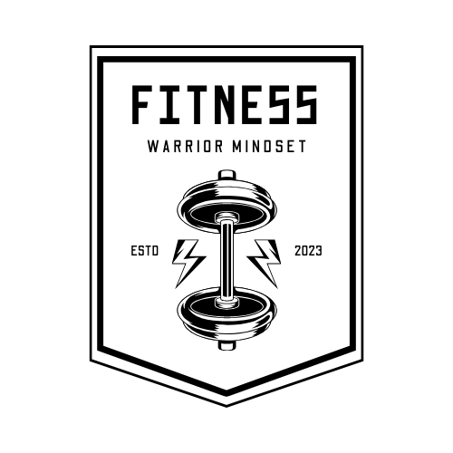

# A's Fitness: A Journey of Physical and Mental Excellence

## Overview

A's Fitness is an empowering application designed to help individuals cultivate the mindset of a warrior by documenting their physical and mental accomplishments, as well as their ongoing pursuit of self-improvement. Whether you're striving for peak physical fitness, mental resilience, or personal growth, A's Fitness provides the tools to track your progress and stay motivated on your journey.

## Key Features

- **Diary Entries**: Keep a detailed record of your daily achievements, challenges, and reflections on your journey to becoming a better warrior.
- **Physical Training Log**: Log your workouts, track your progress, and set goals to enhance your physical strength, endurance, and agility.
- **Mental Wellness Tracker**: Monitor your mental well-being, track mindfulness practices, and record strategies for maintaining mental resilience.
- **Goal Setting and Progress Tracking**: Set achievable goals for both your physical and mental development, and track your progress over time.
- **Integration with Workout_DB API**: Seamlessly access a vast library of workouts and exercises from the Workout_DB API to diversify your training routine.
- **Integration with Google Books API**: Explore a curated selection of books on fitness, mindfulness, and personal development from the Google Books API to further enrich your journey.

## Technologies Used

- **Backend**: Developed with Django and Django Rest Framework (DRF), leveraging PostgreSQL for efficient data storage and management.
- **Frontend**: Built using React with TypeScript, powered by Vite for fast and efficient development.
- **API Integration**: Utilizes the Workout_DB API for accessing workout data and the Google Books API for accessing a wide range of books on relevant topics.
- **Authentication and Authorization**: Implements secure token based user authentication and authorization mechanisms to protect user data and ensure privacy.
- **Responsive Design**: Ensures a seamless user experience across various devices and screen sizes.

## Get Started

To start your journey with A's Fitness:

1. Clone the repository from [GitHub](https://github.com/fravila08/as_fitness.git).
2. Set up the backend environment using Django and PostgreSQL.
3. Set up the frontend environment using React with TypeScript and Vite.
4. Configure API keys for accessing Workout_DB API and Google Books API.
5. Run the application and begin documenting your path to becoming a warrior!

## Contribute

We welcome contributions from fellow warriors! Feel free to submit bug reports, feature requests, or pull requests to help improve A's Fitness and empower more individuals on their journey to greatness.

## Contact

For any inquiries or support, please contact us at [fr4v1l4@gmail.com](mailto:fr4v1l4@gmail.com). Join our community of warriors and share your experiences, challenges, and triumphs in the pursuit of excellence!
