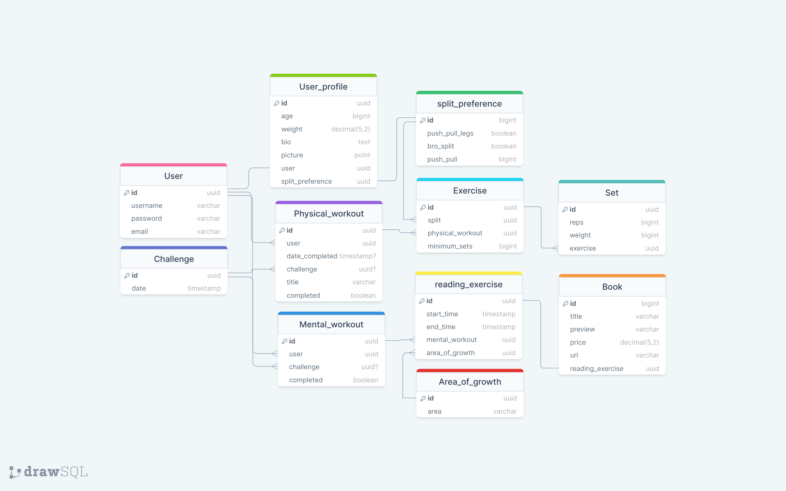

# Relational Database Schema (PostgreSQL)

## User Model

The user model will inherit from the `AbstractUser` model in Django but and will utilize token authentication to access any user unique information.

## User Profile

The `User_profile` will have a one to one relationship to a user and contain all user information outside of administrative permissions/requirements.

## Challenge

The `Challenge` Model will be displayed to both users an none-subscribed users to encourage all people to start their self-improvement journey on a daily basis.

## Split

The `Split` Model will keep track of the split you would like to contain, for now it will have some provided but the endstate is to allow users to create their own splits and control their own workouts.

## Physical Workout

The `Physical_workout` Model will retain all information regarding to one workout. Will likely contain 4-6 exercises with their sets and reps presentable to the user or visitor.

### Physical_exercise

The `Physical_exercise` Model will coordinate to a number of Splits with a many to many relationship and keep track of the minimum number of sets it takes to complete the exercise.

### Set

The `Set` Model will keep track of reps and weight used during the exercise.

## Mental_exercise

The `Mental_exercise` Model will display a book correlating to an area of self improvement that a user should take the time to visit and read for a suggested amount of time.
